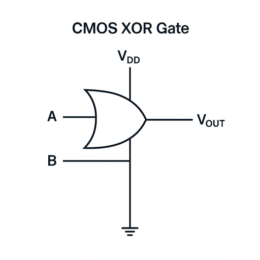
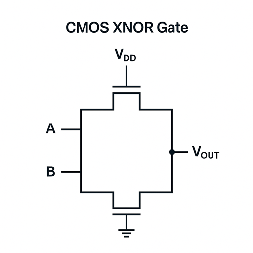
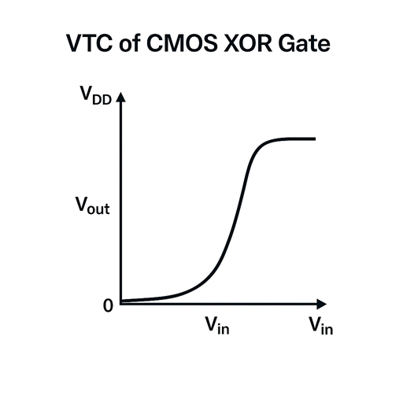

## XOR and XNOR Gates

### Basic Concepts
XOR (Exclusive OR) and XNOR (Exclusive NOR) gates are fundamental logic gates in digital electronics. The XOR gate outputs HIGH when the number of HIGH inputs is odd, while the XNOR gate outputs HIGH when the number of HIGH inputs is even.

### Truth Tables
#### XOR Gate
| A | B | Output |
|---|---|--------|
| 0 | 0 | 0      |
| 0 | 1 | 1      |
| 1 | 0 | 1      |
| 1 | 1 | 0      |

#### XNOR Gate
| A | B | Output |
|---|---|--------|
| 0 | 0 | 1      |
| 0 | 1 | 0      |
| 1 | 0 | 0      |
| 1 | 1 | 1      |

### Boolean Expressions
- XOR: Y = A ⊕ B = A·B' + A'·B
- XNOR: Y = (A ⊕ B)' = A·B + A'·B'

## CMOS XOR and XNOR Gates Basics

CMOS XOR (Exclusive OR) and XNOR (Exclusive NOR) gates are fundamental logic gates in digital integrated circuits. The XOR gate outputs HIGH when the number of HIGH inputs is odd, while the XNOR gate outputs HIGH when the number of HIGH inputs is even.

The CMOS XOR/XNOR implementation consists of:
1. **PMOS (P-channel MOSFET)**: Connected between VDD and output
2. **NMOS (N-channel MOSFET)**: Connected between output and GND
3. **Transmission Gates**: For signal routing and control

### CMOS XOR Gate Implementation

The XOR gate implementation uses:
- Two PMOS transistors in parallel for pull-up
- Two NMOS transistors in series for pull-down
- Transmission gates for signal routing

### CMOS XNOR Gate Implementation

The XNOR gate implementation uses:
- Two PMOS transistors in series for pull-up
- Two NMOS transistors in parallel for pull-down
- Transmission gates for signal routing

## Operation of CMOS XOR and XNOR Gates

The operation of CMOS XOR and XNOR gates can be summarized as follows:

1. **XOR Gate**:
   - When both inputs are LOW (0V): Output is LOW
   - When one input is HIGH (VDD): Output is HIGH
   - When both inputs are HIGH (VDD): Output is LOW

2. **XNOR Gate**:
   - When both inputs are LOW (0V): Output is HIGH
   - When one input is HIGH (VDD): Output is LOW
   - When both inputs are HIGH (VDD): Output is HIGH

This complementary behavior ensures that the XOR and XNOR gates perform their respective logical functions.

## Voltage Transfer Characteristic (VTC)

The Voltage Transfer Characteristic (VTC) of CMOS XOR/XNOR gates plots the output voltage as a function of the input voltage. The VTC shows the transition regions and noise margins.

The VTC can be divided into five regions:
1. **Region I**: Both inputs LOW, Output stable
2. **Region II**: One input transitioning
3. **Region III**: Both inputs transitioning
4. **Region IV**: One input stable, one transitioning
5. **Region V**: Both inputs HIGH, Output stable

### Important Parameters for CMOS XOR/XNOR Gates

1. **Switching Threshold (VM)**: The input voltage at which the output transitions
2. **Noise Margin**: The amount of noise a gate can tolerate
   - **NML (Noise Margin Low)**: VOL - VIL
   - **NMH (Noise Margin High)**: VOH - VIH
3. **Propagation Delay**: Time taken for the output to change in response to an input change
   - **tPLH**: Low-to-High propagation delay
   - **tPHL**: High-to-Low propagation delay
4. **Power Consumption**: Static and dynamic power dissipation

## SPICE Simulation

SPICE (Simulation Program with Integrated Circuit Emphasis) is an industry-standard tool for simulating and analyzing electronic circuits. For CMOS XOR/XNOR gates, we can use SPICE to:

1. Generate the Voltage Transfer Characteristic (VTC)
2. Calculate propagation delays
3. Analyze power consumption
4. Study the effect of transistor sizing on performance

A basic SPICE netlist for CMOS XOR/XNOR gates includes:
- MOSFET models for NMOS and PMOS
- Power supply definition
- Input voltage sources
- Node connections
- Analysis commands (DC sweep, transient analysis, etc.)

In this experiment, we will create SPICE netlists for XOR and XNOR gates and observe their behavior through simulation.

## CMOS Implementation

### Transmission Gate Based Implementation
XOR and XNOR gates can be implemented using transmission gates, which provide efficient and reliable operation. The implementation uses:
- PMOS and NMOS transistors in parallel
- Control signals for switching
- Proper sizing for balanced performance

### Transistor Count
- Basic XOR/XNOR implementation: 8 transistors
- Optimized implementation: 6-12 transistors (depending on topology)

### Performance Parameters

### 1. Voltage Transfer Characteristic (VTC)
- Shows relationship between input and output voltages
- Key points:
  - Switching threshold (VM)
  - Noise margins (NML, NMH)
  - Gain at switching point

### 2. Propagation Delay
- Time taken for output to respond to input change
- Factors affecting delay:
  - Transistor sizes
  - Load capacitance
  - Input transition time
  - Power supply voltage

### 3. Power Consumption
- Static power: Leakage current
- Dynamic power: Switching activity
- Short-circuit power: During transitions

### 4. Noise Margin
- Low noise margin (NML)
- High noise margin (NMH)
- Affected by:
  - Transistor sizing
  - Power supply voltage
  - Temperature

## SPICE Analysis

### 1. DC Analysis
- Purpose: Determine VTC
- Commands:
  - .DC for voltage sweep
  - .PRINT for output
  - .MEASURE for parameters

### 2. Transient Analysis
- Purpose: Measure timing parameters
- Commands:
  - .TRAN for time domain
  - .MEASURE for delay
  - .PRINT for waveforms

### 3. Power Analysis
- Purpose: Calculate power consumption
- Methods:
  - Average power
  - Peak power
  - Energy per operation

### Design Considerations

### 1. Transistor Sizing
- PMOS/NMOS ratio
- Channel length
- Width optimization
- Impact on performance

### 2. Layout Issues
- Area minimization
- Routing complexity
- Parasitic effects
- Matching requirements

### 3. Optimization Techniques
- Power optimization
- Speed optimization
- Area optimization
- Trade-off analysis

### Applications

### 1. Digital Circuits
- Arithmetic units
- Parity generators
- Comparators
- Error detection

### 2. Memory Systems
- Address decoders
- Sense amplifiers
- Error correction

### 3. Communication Systems
- Encoders/Decoders
- Error detection
- Data transmission

### Advanced Topics

### 1. Process Variations
- Impact on performance
- Statistical analysis
- Design margins
- Yield considerations

### 2. Temperature Effects
- Threshold voltage variation
- Mobility changes
- Leakage current
- Performance degradation

### 3. Scaling Effects
- Short-channel effects
- Leakage power
- Process variations
- Reliability issues